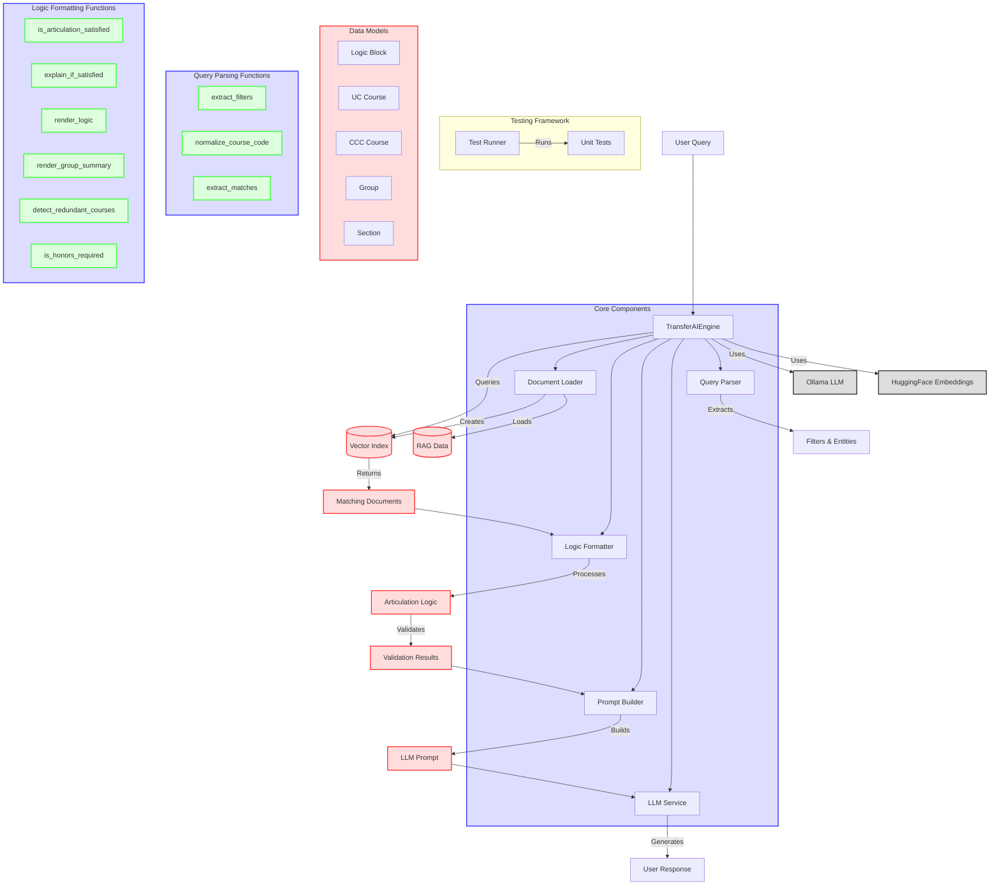

# TransferAI Architecture Diagram

## Architecture Flow Description

1. The system starts with a user query like "What De Anza courses satisfy CSE 8A at UCSD?"
2. The `TransferAIEngine` in `main.py` receives and processes this query
3. `query_parser.py` extracts relevant filters and entities (course codes, group references)
4. The system queries the vector index to retrieve matching documents
5. For each document, `logic_formatter.py` processes the articulation logic
6. Validation functions check if specific courses satisfy requirements
7. `prompt_builder.py` constructs an appropriate prompt for the LLM
8. The LLM (via Ollama) generates the final response

The system's modular design allows for targeted improvements in each component while maintaining overall functionality. The most complex component is `logic_formatter.py`, which handles the critical logic processing and validation logic. 