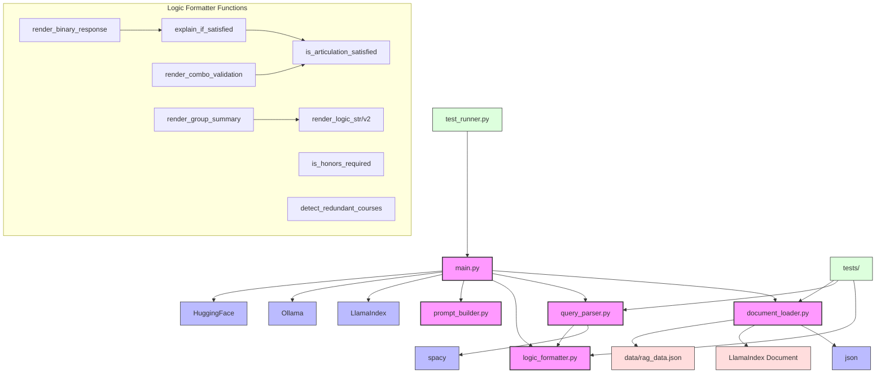

# TransferAI Module Dependencies

## Module Dependency Description

### Core Module Dependencies

1. **main.py** - The central engine module that depends on:
   - `document_loader.py` for loading articulation data
   - `query_parser.py` for extracting query entities
   - `logic_formatter.py` for processing articulation logic
   - `prompt_builder.py` for generating LLM prompts
   - External libraries: LlamaIndex, Ollama, HuggingFace

2. **document_loader.py** - Depends on:
   - `json` for parsing RAG data
   - LlamaIndex Document model for creating searchable documents

3. **query_parser.py** - Depends on:
   - `spacy` for natural language processing
   - Has some references to logic_formatter functions

4. **logic_formatter.py** - Contains the most internal dependencies:
   - `is_articulation_satisfied` - Core validation function
   - `explain_if_satisfied` - Uses is_articulation_satisfied
   - Various rendering functions that depend on each other

5. **prompt_builder.py** - Relatively independent module with PromptType enum

### Testing Dependencies

- `test_runner.py` depends on the main engine
- Unit tests in the `tests/` directory directly test individual modules

### Data Flow Dependencies

- `document_loader.py` reads from `data/rag_data.json`
- `main.py` builds the vector index from loaded documents
- `query_parser.py` extracts filters from user queries
- `logic_formatter.py` processes documents and logic blocks
- `prompt_builder.py` creates prompts based on processed data

This module structure highlights how `logic_formatter.py` has become a central, complex component with multiple responsibilities that would benefit from refactoring into more focused modules as outlined in the v1.5 roadmap. 